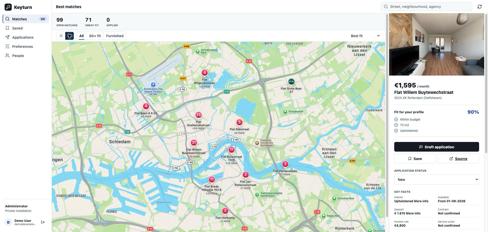

# Keyturn

Self-hosted, multi-user rental search for Pararius with fit scoring, application tracking, alerts, and Apple Maps. All runtime state lives in one SQLite database.



```sh
git clone https://github.com/littledivy/keyturn.git
cd keyturn
cp .env.example .env
docker compose up -d --build
```

Open `http://127.0.0.1:5051`.

The first account becomes the administrator and can create one-time invite links from **People**. Accounts, preferences, listings, application states, coordinates, invites, and alert history live in `/data/rentals.db`.

Configure either `MAPKIT_TOKEN` or the MapKit signing variables in `.env` to enable the Apple Maps view. Dynamic tokens are short-lived and keep the private key on the server.
When using Docker, `MAPKIT_PRIVATE_KEY_PATH` is bind-mounted read-only into the container.

```sh
docker compose logs -f
docker compose exec keyturn python -m pytest -q
docker compose exec keyturn sqlite3 /data/rentals.db ".backup '/data/keyturn-backup.db'"
```

The web process and watcher share the same WAL-mode SQLite database. Configure SMTP variables in `.env` for email alerts. Put the app behind HTTPS and set `APP_URL` plus `COOKIE_SECURE=true` before exposing it outside your network.

Keyturn is not affiliated with or endorsed by Pararius. Operators are responsible for complying with website terms, robots policies, privacy rules, and applicable law. Review applications before sending them.

MIT licensed. See [LICENSE](LICENSE).
